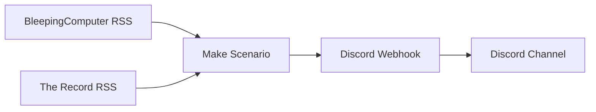

# CTI-feed-pipeline

An automated threat intelligence aggregation pipeline that delivers curated cybersecurity news and advisories into a Discord channel in real time, built using Make and Discord webhooks.

---

## Overview

Security analysts monitoring threat intelligence across multiple sources face a context switching problem. Manually visiting disparate sites throughout the day breaks workflow and increases the risk of missing time sensitive advisories. This pipeline consolidates high signal RSS feeds into a single Discord channel, giving analysts one place to monitor rather than many.

This pipeline consolidates two high signal RSS feeds into a single Discord channel, surfacing new threat intelligence automatically every 15 minutes without analyst intervention.

---

## Architecture



Two independent Make scenarios poll their respective RSS feeds on a 15 minute interval. On detection of a new item, each scenario extracts the article title, URL, and publication timestamp, then delivers a formatted message to a Discord channel via webhook.

---

## Intelligence Sources

### BleepingComputer

`https://www.bleepingcomputer.com/feed/`

This provides timely, technically detailed reporting on vulnerabilities, malware campaigns, ransomware activity, and active breaches. Selected for its practitioner level depth and high publication frequency on active threats.


_Fig 1: BleepingComputer RSS feed configured in Make_

### The Record by Recorded Future

`https://therecord.media/feed`

This provides reliable, well researched coverage of major cybersecurity incidents, threat actor activity, and developments across the broader threat landscape. It was selected for its strategic and operational context that complements the tactical depth of BleepingComputer.

These two sources are intentionally paired to cover different intelligence layers; tactical indicators and active campaigns from BleepingComputer, strategic threat actor and incident coverage from The Record.

---

## Pipeline Configuration

### RSS Module

Each scenario is configured with a 5-item cap on initial retrieval and initialized from the point of deployment, preventing retroactive flooding of the channel with historical articles.


_Fig 2: Feed initialization set to From now on_

### Discord Webhook

A Discord webhook is created directly on the target channel under Integrations. The webhook URL serves as the delivery endpoint for all Make HTTP requests.


_Fig 3: Discord webhook creation_

### HTTP Module

The HTTP module sends a POST request to the Discord webhook URL with a JSON payload mapping the RSS item's title, link, and publication date.


_Fig 4: Webhook URL configured_


_Fig 5: JSON body mapping RSS fields to Discord message_

```json
{
  "content": "**{{1.title}}**\n{{1.url}}\n🕒 {{1.pubDate}}"
}
```

### Completed Scenario Canvas


_Fig 6: RSS module connected to HTTP module_

---

## Design Decisions

### Why Make?
Make provides a visual automation canvas that makes the pipeline logic transparent and auditable. Scenarios can be monitored, modified, and extended without code, while still running on a reliable scheduled trigger.

### Why HTTP Module Instead of the Native Discord Module
Make's native Discord module requires OAuth bot authentication, an unnecessary overhead for a pipeline that only sends messages in one direction. A Discord webhook accepts a standard HTTP POST request, which the HTTP module handles directly. No bot registration, no token management, same result.

---

## Operational Application

Intelligence surfaced by this pipeline feeds into SOC operations in the following ways:

- **Vulnerability triage**: Active exploits reported against products or services in the monitored environment trigger patch and upgrade prioritization
- **Threat hunting**: IOCs published in articles are tested against the environment through targeted hunt activities
- **Threat actor awareness**: Coverage of active threat groups informs detection rule tuning and hunt hypothesis development

---

## Live Output


_Fig 7: CTI articles delivering into Discord channel live_

---

## Active Scenarios


_Fig 8: Both scenarios active on Make dashboard_

---

## Limitations

- Make free tier restricts this to two active scenarios
- A production deployment would route feeds into dedicated Discord channels by threat category rather than a single shared channel
- IOC extraction is manual : articles require analyst review before acting on indicators

---
